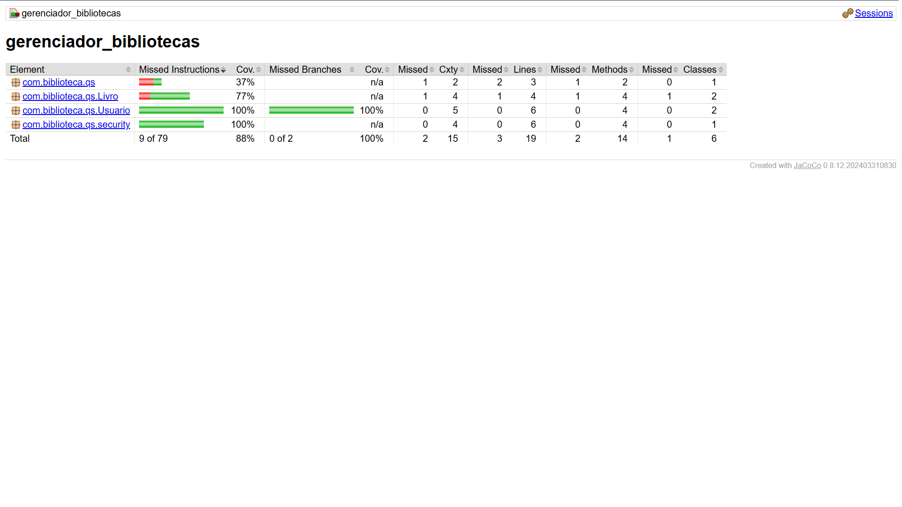

# Gerenciador de Biblioteca Pessoal 📚

Projeto acadêmico desenvolvido para a disciplina de **Qualidade de Software (Senac)**. O objetivo é demonstrar a aplicação de testes automatizados, garantindo robustez e testabilidade através de práticas modernas.

## 🚀 Tecnologias e Ferramentas
- **Backend:** Java 21 / Spring Boot 3.4.3.
- **Base de Dados:** MongoDB (NoSQL).
- **Testcontainers:** Utilizados para garantir testes de integração com instâncias reais de base de dados, eliminando o uso de Mocks para persistência.
- **VCR / WireMock:** Simulação e gravação de interações com APIs externas para o requisito de ISBN.
- **JaCoCo:** Ferramenta para análise e geração de relatórios de cobertura de código.

## 📊 Evidência de Cobertura de Testes (JaCoCo)

O projeto atingiu a meta de cobertura estabelecida pela disciplina, garantindo a qualidade das rotas críticas e da lógica de negócio.



## 📊 Comandos Úteis
Para rodar os testes e gerar o relatório de cobertura:
```bash
./mvnw clean verify