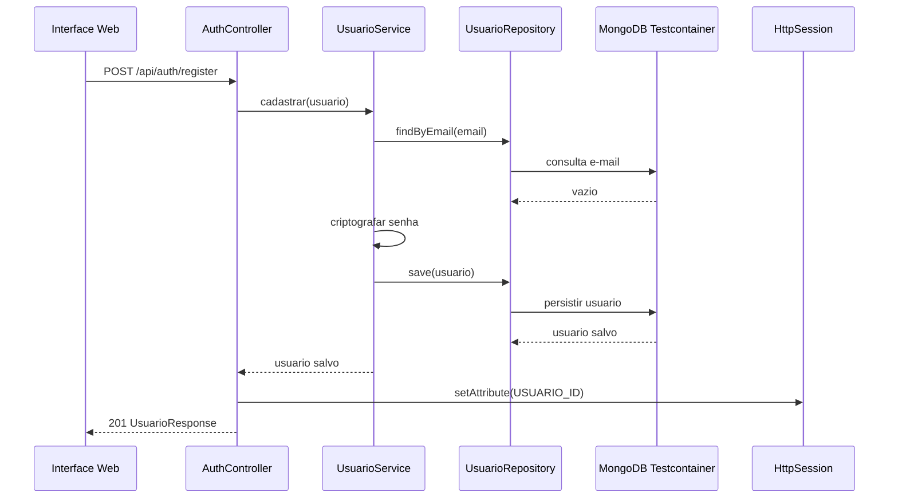
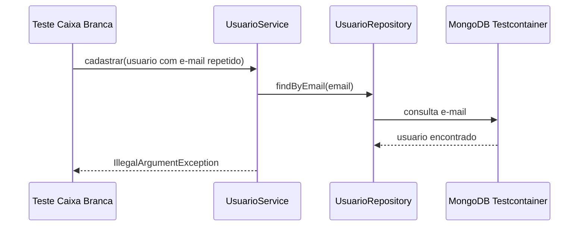
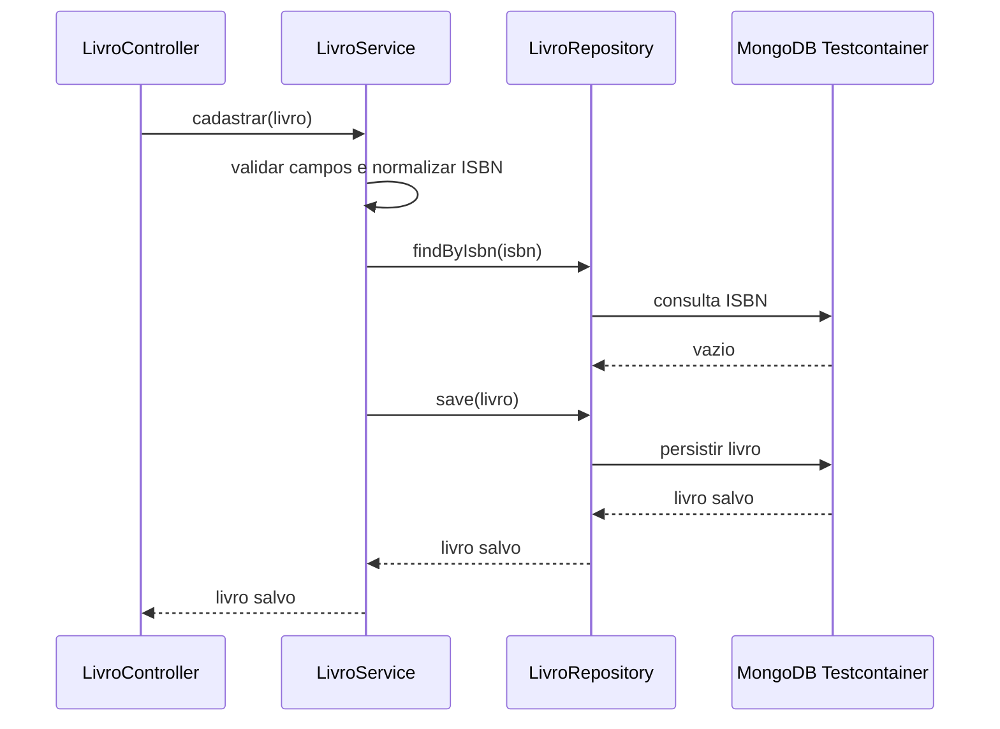
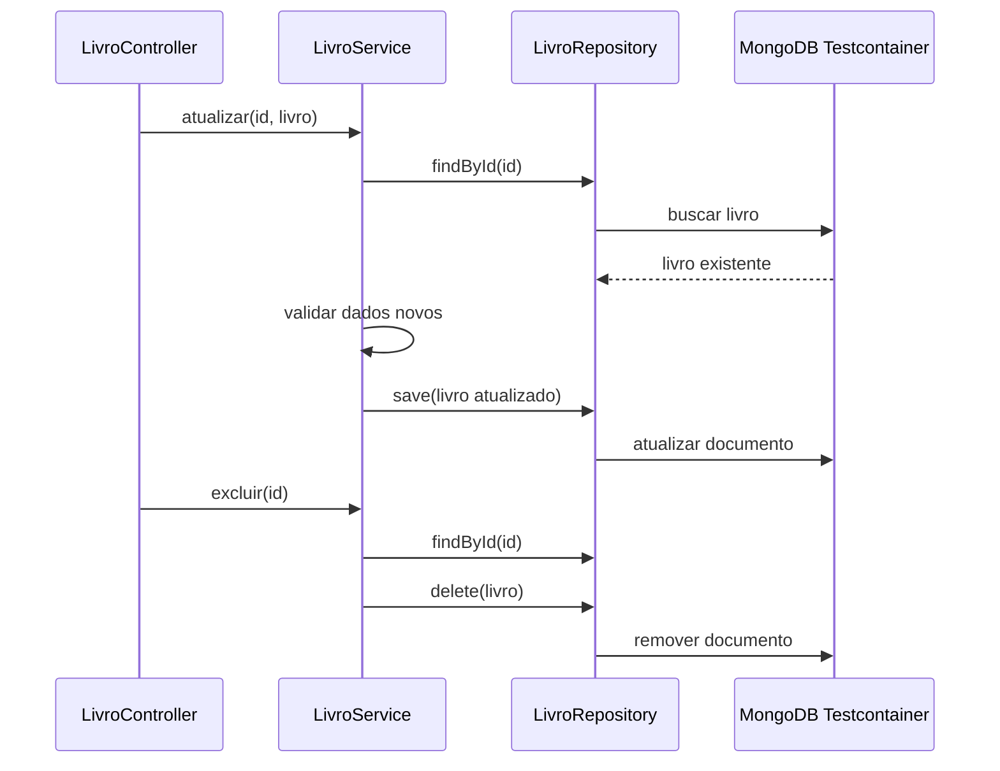
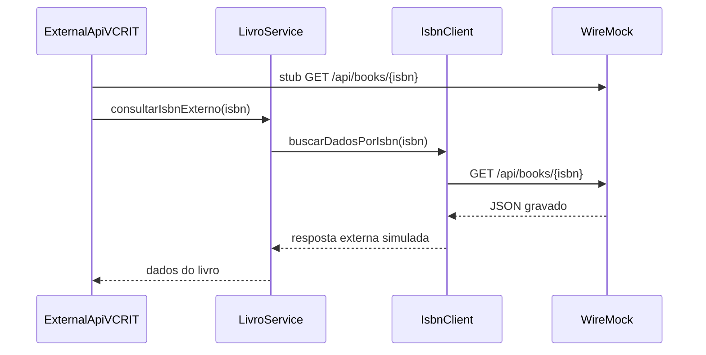

# RTM - Matriz de Rastreabilidade de Requisitos

Projeto: Gerenciador de Biblioteca Pessoal  
Disciplina: Qualidade de Software - SENAC  

## Requisitos Funcionais

| ID | Requisito | Implementacao | Testes |
| --- | --- | --- | --- |
| RF01 | Cadastrar usuario com nome, e-mail e senha. | `UsuarioController`, `AuthController`, `UsuarioService` | `UsuarioControllerIT.deveCadastrarUsuarioViaApi`, `AuthControllerIT.deveRegistrarUsuarioEConsultarSessaoAtual` |
| RF02 | Impedir cadastro de e-mail duplicado. | `UsuarioService.cadastrar` | `UsuarioServiceIT.deveLancarExcecaoParaEmailDuplicado`, `UsuarioControllerIT.deveRetornarErroParaEmailDuplicado` |
| RF03 | Autenticar usuario e manter sessao. | `AuthController`, `UsuarioService.autenticar` | `AuthControllerIT.deveRealizarLoginComCredenciaisValidas`, `AuthControllerIT.deveRegistrarUsuarioEConsultarSessaoAtual` |
| RF04 | Recusar credenciais invalidas. | `UsuarioService.autenticar`, `ApiExceptionHandler` | `UsuarioServiceIT.deveLancarExcecaoParaSenhaIncorreta`, `AuthControllerIT.deveRecusarLoginComCredenciaisInvalidas` |
| RF05 | Cadastrar livro. | `LivroController`, `LivroService.cadastrar` | `LivroControllerIT.deveCadastrarLivroViaEndpoint`, `LivroServiceIT.deveCadastrarEListarLivros` |
| RF06 | Listar livros cadastrados. | `LivroController.listarTodos`, `LivroService.findAll` | `LivroControllerIT.deveListarLivrosViaEndpoint`, `LivroServiceIT.deveCadastrarEListarLivros` |
| RF07 | Atualizar livro existente. | `LivroController.atualizar`, `LivroService.atualizar` | `LivroControllerIT.deveAtualizarLivroViaEndpoint` |
| RF08 | Excluir livro existente. | `LivroController.excluir`, `LivroService.excluir` | `LivroControllerIT.deveExcluirLivroViaEndpoint` |
| RF09 | Impedir ISBN duplicado. | `LivroService.garantirIsbnUnico`, `LivroRepository.findByIsbn` | `LivroServiceIT.deveRejeitarIsbnDuplicado`, `LivroControllerIT.deveRetornarConflitoParaIsbnDuplicado` |
| RF10 | Validar e normalizar ISBN. | `LivroService.normalizarIsbn` | `LivroServiceIT.deveNormalizarIsbnAntesDePersistir`, `LivroServiceIT.deveRejeitarIsbnInvalido` |
| RF11 | Consultar dados externos por ISBN sem depender de internet nos testes. | `IsbnClient`, `LivroService.consultarIsbnExterno` | `ExternalApiVCRIT.deveSimularGravacaoVCR` |
| RF12 | Disponibilizar interface web funcional com gerenciamento de sessao. | `src/main/resources/static/index.html` | Coberto indiretamente pelos endpoints de auth/livros em `AuthControllerIT` e `LivroControllerIT` |

## Requisitos Nao Funcionais

| ID | Requisito | Evidencia |
| --- | --- | --- |
| RNF01 | Usar Spring Boot, MongoDB e arquitetura MVC. | Pacotes `Controller`, `Service`, `Repository` e `@Document` MongoDB |
| RNF02 | Nao usar mocks para persistencia. | Testes `*IT` usam `MongoDBContainer("mongo:7")` |
| RNF03 | Usar VCR/WireMock para chamadas externas. | `ExternalApiVCRIT` usa `@WireMockTest` |
| RNF04 | Cobertura minima de 80%. | Regra `jacoco:check` no `pom.xml` |
| RNF05 | CI em GitHub Actions. | `.github/workflows/ci.yml` |
| RNF06 | Analise SonarCloud/SonarQube. | `sonar-project.properties` e etapa `SonarCloud` no CI |
| RNF07 | Documentacao de rastreabilidade. | Este arquivo `RTM.md` |

## Diagramas de Sequencia

### RF01/RF03 - Cadastro e Sessao

### RF02 - E-mail Duplicado

### RF05/RF09/RF10 - Cadastro de Livro

### RF07/RF08 - Atualizacao e Exclusao de Livro

### RF11 - Consulta Externa com WireMock/VCR

## Criterios de Aceite da Entrega

- `./mvnw clean verify` deve passar com Docker ativo.
- GitHub Actions deve ficar verde em `push` e `pull_request`.
- Relatorio JaCoCo deve apresentar cobertura minima de 80%.
- SonarCloud deve executar quando `SONAR_TOKEN` estiver configurado.
- Nenhum segredo deve ser versionado em cassetes, propriedades ou workflow.
