# RTM - Matriz de Rastreabilidade de Requisitos

Projeto: Gerenciador de Biblioteca Pessoal  
Disciplina: Qualidade de Software - SENAC

## Requisitos Funcionais

| ID | Requisito | Regra de negocio | Implementacao | Testes |
| --- | --- | --- | --- | --- |
| RF01 | Cadastrar usuario. | O sistema deve cadastrar usuario com nome, e-mail e senha; quando CEP for informado, deve preencher o endereco por API externa controlada por VCR/WireMock. | `UsuarioController`, `AuthController`, `UsuarioService.cadastrar`, `ViaCepClient` | `UsuarioControllerIT.deveCadastrarUsuarioViaApi`, `AuthControllerIT.deveRegistrarUsuarioEConsultarSessaoAtual`, `UsuarioServiceIT.deveCadastrarUsuarioComSucessoECriptografarSenha`, `ExternalApiVCRIT.deveSimularConsultaViaCepNoCadastroUsuario` |
| RF02 | Impedir e-mail duplicado. | Nao deve existir mais de um usuario com o mesmo e-mail normalizado. | `UsuarioService.cadastrar`, `UsuarioRepository.findByEmail` | `UsuarioServiceIT.deveLancarExcecaoParaEmailDuplicado`, `UsuarioControllerIT.deveRetornarErroParaEmailDuplicado` |
| RF03 | Autenticar usuario e manter sessao. | Credenciais validas devem iniciar sessao HTTP e permitir consulta do usuario atual. | `AuthController`, `UsuarioService.autenticar`, `HttpSession` | `AuthControllerIT.deveRealizarLoginComCredenciaisValidas`, `AuthControllerIT.deveRegistrarUsuarioEConsultarSessaoAtual`, `UsuarioServiceIT.deveAutenticarUsuarioComSenhaCorreta`, `UsuarioServiceIT.deveAutenticarNormalizandoEmailComEspacosEMaiusculas` |
| RF04 | Recusar credenciais invalidas. | Login com senha ou usuario invalidos deve ser recusado com erro de regra de negocio. | `UsuarioService.autenticar`, `ApiExceptionHandler` | `UsuarioServiceIT.deveLancarExcecaoParaSenhaIncorreta`, `AuthControllerIT.deveRecusarLoginComCredenciaisInvalidas` |
| RF05 | Cadastrar livro para usuario autenticado. | O livro deve ser salvo vinculado ao usuario da sessao. Requisicoes sem sessao devem ser recusadas. A API recebe `LivroRequest` e devolve `LivroResponse`, sem expor diretamente a entidade persistente. | `LivroController.cadastrar`, `LivroRequest`, `LivroResponse`, `LivroService.cadastrar` | `LivroControllerIT.deveCadastrarLivroViaEndpoint`, `LivroControllerIT.deveRecusarRequisicaoSemSessao`, `LivroServiceIT.deveCadastrarEListarLivrosDoUsuario` |
| RF06 | Listar livros do usuario autenticado. | A listagem deve retornar apenas os livros pertencentes ao usuario da sessao usando DTO de resposta. | `LivroController.listarTodos`, `LivroResponse`, `LivroService.findAll`, `LivroRepository.findByUsuarioId` | `LivroControllerIT.deveListarLivrosViaEndpoint`, `LivroServiceIT.deveCadastrarEListarLivrosDoUsuario` |
| RF07 | Atualizar livro do usuario autenticado. | Somente livro pertencente ao usuario da sessao pode ser atualizado; os novos dados devem ser recebidos por DTO e validados antes da persistencia. | `LivroController.atualizar`, `LivroRequest`, `LivroResponse`, `LivroService.atualizar`, `LivroRepository.findByIdAndUsuarioId` | `LivroControllerIT.deveAtualizarLivroViaEndpoint`, `LivroServiceIT.deveAtualizarLivroMantendoMesmoIsbn`, `LivroServiceIT.deveRejeitarAtualizacaoComIsbnDeOutroLivroDoMesmoUsuario` |
| RF08 | Excluir livro do usuario autenticado. | Somente livro pertencente ao usuario da sessao pode ser excluido. | `LivroController.excluir`, `LivroService.excluir`, `LivroRepository.findByIdAndUsuarioId` | `LivroControllerIT.deveExcluirLivroViaEndpoint` |
| RF09 | Impedir ISBN duplicado para o mesmo usuario. | O mesmo usuario nao pode cadastrar dois livros com o mesmo ISBN normalizado; usuarios diferentes podem ter o mesmo ISBN em suas bibliotecas pessoais. | `LivroService.garantirIsbnUnico`, `LivroRepository.findByIsbnAndUsuarioId` | `LivroServiceIT.deveRejeitarIsbnDuplicadoParaOMesmoUsuario`, `LivroServiceIT.devePermitirMesmoIsbnParaUsuariosDiferentes`, `LivroControllerIT.deveRetornarConflitoParaIsbnDuplicado`, `LivroRepositoryIT.deveBuscarLivroPorIsbnEUsuarioId` |
| RF10 | Validar e normalizar ISBN. | ISBN deve ser normalizado, aceitando ISBN-10 ou ISBN-13 validos, e recusando valores nulos, vazios ou invalidos. | `LivroService.normalizarIsbn` | `LivroServiceIT.deveNormalizarIsbnAntesDePersistir`, `LivroServiceIT.deveAceitarIsbn10ComXFinal`, `LivroServiceIT.deveAceitarIsbn10ApenasNumerico`, `LivroServiceIT.deveRejeitarIsbnInvalido`, `LivroServiceIT.deveRejeitarIsbnNuloOuVazio` |
| RF11 | Consultar API externa com VCR/WireMock. | Chamadas ao ViaCEP devem ser reproduzidas em teste sem internet real, cobrindo sucesso, CEP invalido, CEP nao encontrado e indisponibilidade externa. | `ViaCepClient`, `UsuarioService.preencherEnderecoQuandoCepInformado` | `ExternalApiVCRIT.deveSimularConsultaViaCepNoCadastroUsuario`, `ExternalApiVCRIT.deveRejeitarCepComFormatoInvalidoAntesDaConsultaExterna`, `ExternalApiVCRIT.deveRetornarErroQuandoViaCepInformarCepNaoEncontrado`, `ExternalApiVCRIT.deveRetornarErroQuandoViaCepEstiverIndisponivel`, `UsuarioControllerIT.deveConsultarEnderecoPorCepViaApi` |
| RF12 | Disponibilizar interface web funcional com sessao. | A aplicacao deve servir uma interface web para cadastro/login e operacoes de livros usando a sessao do usuario autenticado. | `src/main/resources/static/index.html`, endpoints `/api/auth` e `/api/livros` | `FrontendIT.deveServirInterfaceWeb`, `AuthControllerIT.deveRegistrarUsuarioEConsultarSessaoAtual`, `LivroControllerIT.deveCadastrarLivroViaEndpoint`, `LivroControllerIT.deveListarLivrosViaEndpoint` |

## Requisitos Nao Funcionais

| ID | Requisito | Evidencia |
| --- | --- | --- |
| RNF01 | Usar Spring Boot, MongoDB e arquitetura MVC. | Camadas `Controller`, `Service`, `Repository`, entidades MongoDB com `@Document` e aplicacao Spring Boot. |
| RNF02 | Proibido usar mocks no projeto final. | A busca por `Mockito`, `@Mock`, `@MockBean`, `mock()` e `when()` nao encontrou uso de mocks. A dependencia transitiva de Mockito foi excluida do `spring-boot-starter-test`. Persistencia e testada com `MongoDBContainer("mongo:7")`. A unica simulacao permitida e a API externa via WireMock/VCR. |
| RNF03 | Usar Testcontainers para persistencia. | Testes `*IT` de usuarios, livros e repositorios usam `@Testcontainers`, `@Container`, `@ServiceConnection` e `MongoDBContainer("mongo:7")`. |
| RNF04 | Usar VCR para chamadas externas. | `ExternalApiVCRIT` e `UsuarioControllerIT` usam `@WireMockTest` para reproduzir respostas do ViaCEP sem depender de internet. |
| RNF05 | Cobertura minima de 80%. | Regra `jacoco:check` no `pom.xml`, validada no comando `./mvnw clean verify`. |
| RNF06 | CI em GitHub Actions. | Workflow `.github/workflows/ci.yml` executa build, testes, cobertura e analise de qualidade. |
| RNF07 | Analise SonarCloud/SonarQube. | `sonar-project.properties` e etapa `SonarCloud` no CI, executada quando `SONAR_TOKEN` estiver configurado. |
| RNF08 | Rastreabilidade completa. | Este `RTM.md` mapeia cada requisito funcional aos testes e a um diagrama UML de sequencia individual. |

## Verificacao de Mocks

O enunciado proibe mocks no projeto final. A verificacao local buscou os principais sinais de mocks em codigo e testes:

```powershell
rg -n "mock|Mock|Mockito|@Mock|@MockBean|mockito|when\(|verify\(" src pom.xml
```

Resultado considerado conforme:

- Nao ha dependencia Mockito declarada manualmente no `pom.xml`; `mockito-core` e `mockito-junit-jupiter` estao excluidos do `spring-boot-starter-test`.
- Nao ha `@Mock`, `@MockBean`, `Mockito`, `mock()`, `when()` ou `verify()` aplicados a regras de negocio ou persistencia.
- A persistencia usa MongoDB real em container nos testes de integracao.
- WireMock aparece apenas como VCR/simulacao permitida para a API externa ViaCEP.

## Diagramas de Sequencia

### RF01 - Cadastrar Usuario

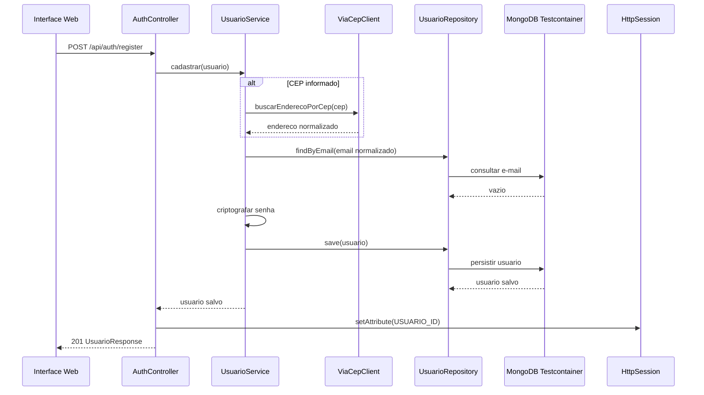

### RF02 - Impedir E-mail Duplicado

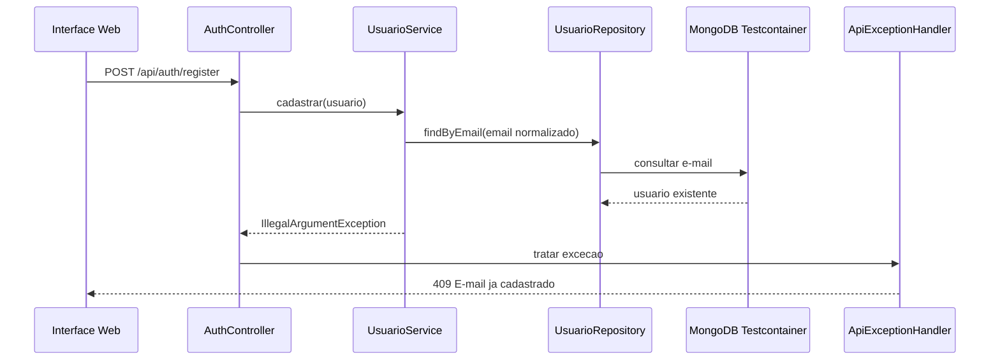

### RF03 - Autenticar Usuario e Manter Sessao

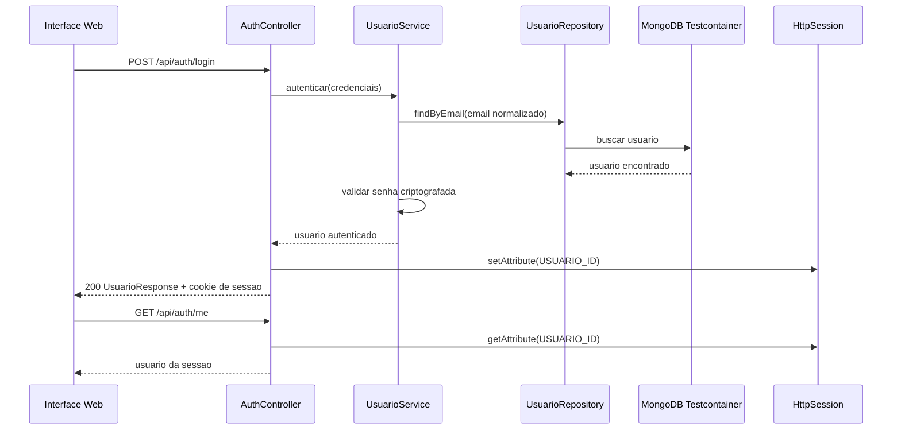

### RF04 - Recusar Credenciais Invalidas

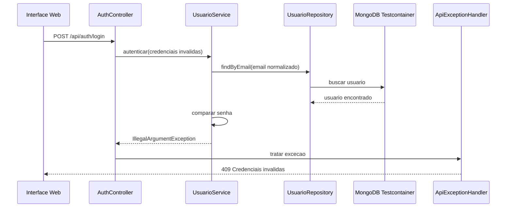

### RF05 - Cadastrar Livro para Usuario Autenticado

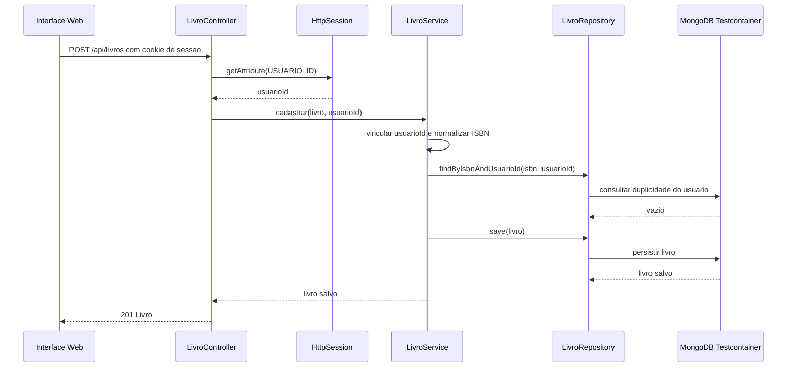

### RF06 - Listar Livros do Usuario Autenticado

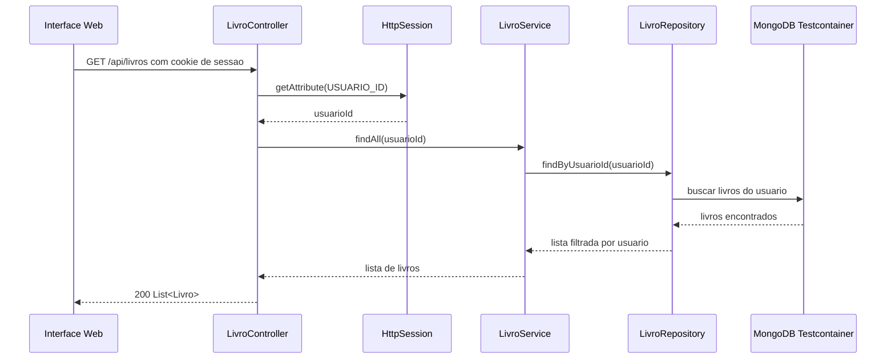

### RF07 - Atualizar Livro do Usuario Autenticado

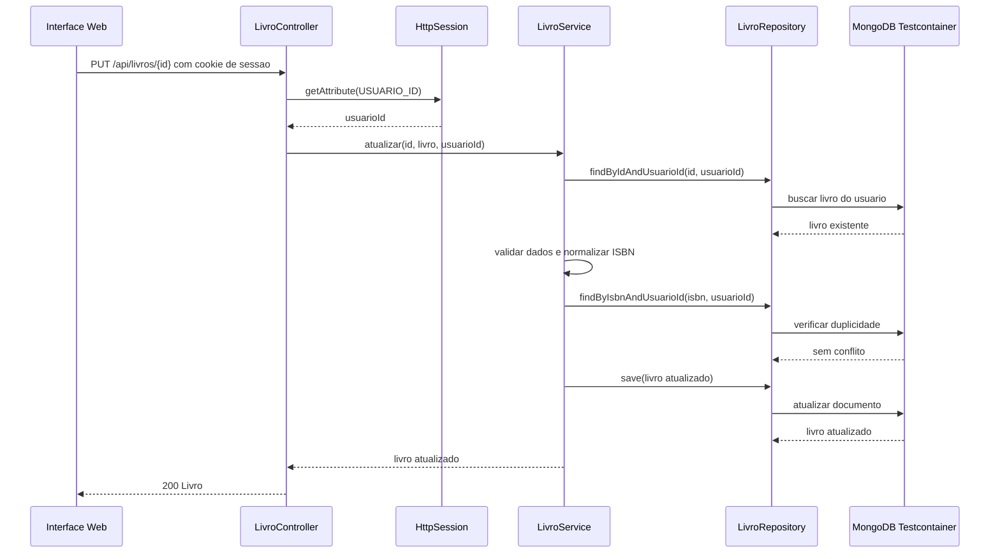

### RF08 - Excluir Livro do Usuario Autenticado

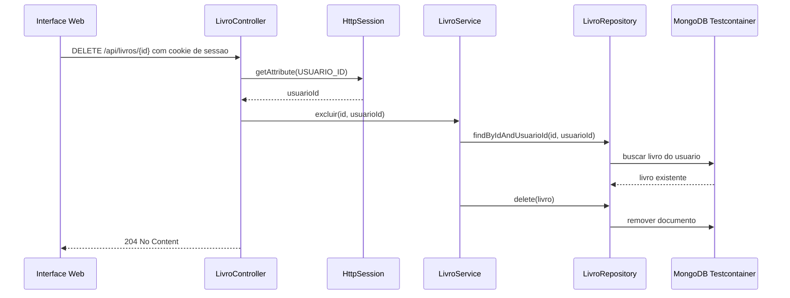

### RF09 - Impedir ISBN Duplicado para o Mesmo Usuario

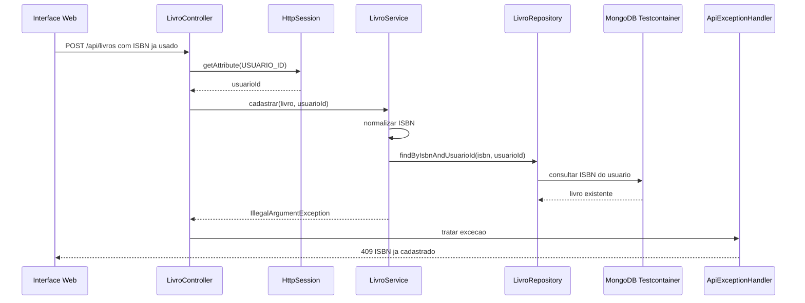

### RF10 - Validar e Normalizar ISBN

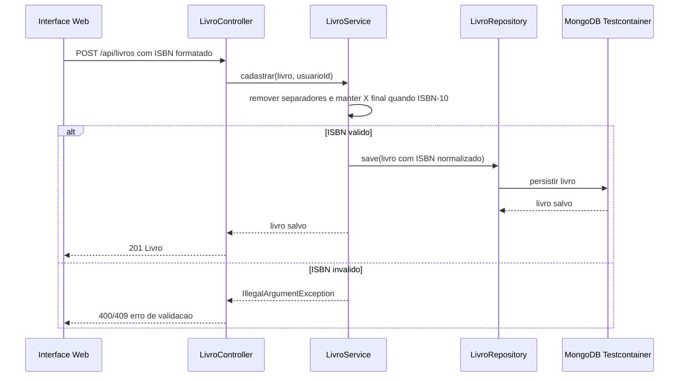

### RF11 - Consultar API Externa com VCR/WireMock

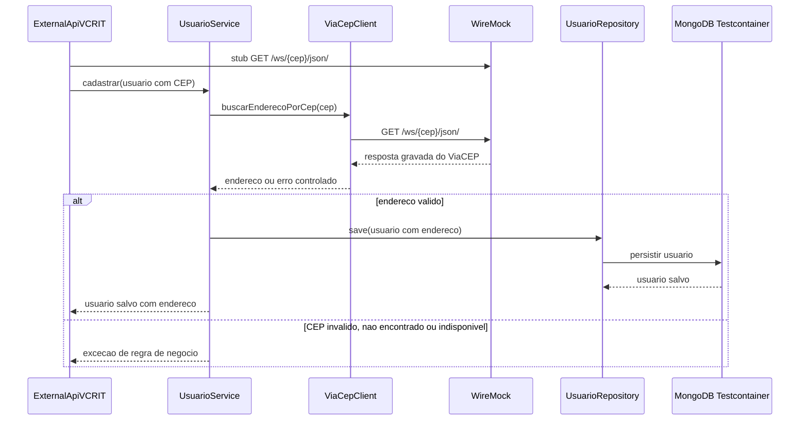

### RF12 - Interface Web Funcional com Sessao

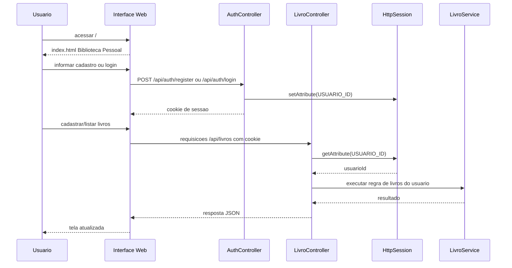

## Criterios de Aceite da Entrega

- `./mvnw clean verify` deve passar com Docker ativo.
- GitHub Actions deve ficar verde em `push` e `pull_request`.
- Relatorio JaCoCo deve apresentar cobertura minima de 80%.
- SonarCloud deve executar quando `SONAR_TOKEN` estiver configurado.
- Nenhum segredo deve ser versionado em cassetes, propriedades ou workflow.
- Nao deve haver mocks em regras de negocio ou persistencia; persistencia deve usar Testcontainers e chamadas externas devem usar VCR/WireMock.
